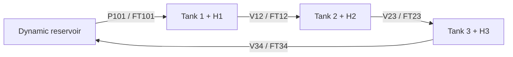

# Heated Cascade model

`scenario = "cascade"` · [User guide](../user-guide.md)

## Physical interface



Same hydraulic equipment as [Three-Tank](three_tank.md), plus independently
commanded `2 kW` heaters. Default availability is H1 only.

| Interface | Ordered values / units |
|---|---|
| State | `[h1, T1, h2, T2, h3, T3, reservoir_volume, reservoir_temperature]`; m, degC, m^3 |
| Output / reference | `[h1, h2, h3, T1, T2, T3]` |
| Direct action | `[P101, V12, V23, V34, H1, H2, H3]`, each in `[0, 1]` |
| Observation | `[h1, T1, h2, T2, h3, T3, FT101, FT12, FT23, FT34, h1_sp, h2_sp, h3_sp, T1_sp, T2_sp, T3_sp]` |
| Scaling | All observations `[0, 1]`; flowmeters use `0–10 L/min` |
| Hidden state | Reservoir volume/temperature; inspect `info["reservoir_volume_m3"]` / `info["reservoir_temperature"]` |
| Timing | Control `2 s` |
| Heater availability | Binary `parameters={"heater": [1, 0, 0]}`; direct interface always 16 observations / 7 actions |

Unavailable heaters retain commanded actions in records, but applied action,
delivered heat, and energy are zero. PID/MPC/learned policies receive no true
hidden reservoir state through context. Bypass positions and ambient conditions
remain diagnostics in `info["disturbance"]`.

## Physical balances and safety

| Balance / equipment | Behavior |
|---|---|
| Hydraulic path | Pump → Tank 1 → Tank 2 → Tank 3 → reservoir; passive overflow returns directly to reservoir |
| BV12/BV23/BV34 | Parallel bypass disturbances; outlet meters measure valve flow only |
| Tank heat balance | Inlet mixing + electrical heat × efficiency − ambient loss |
| Reservoir | Dynamic liquid/energy inventory; default `90 L` at ambient `20 degC`, capacity `180 L` |
| Heat loss | `40 W/K` per tank and reservoir |
| Makeup / drain / reservoir overflow | None; total liquid is conserved |

| Safety condition | Response |
|---|---|
| High process-tank level | Same pump trip and overflow rules as Three-Tank |
| Heater tank level `< 0.10 m` | Disable that heater |
| Heater tank temperature `≥ 80 degC` | Disable that heater; interlock alone is not terminal |
| Tank level outside `0–0.50 m` | Terminate |
| Reservoir outside `0–180 L` | Terminate |
| Any tank/reservoir temperature `< 0` or `≥ 90 degC` | Terminate |

Step diagnostics include actual electrical power, liquid heat input, and per-heater interlocks.

## Default task

| Setting | Value |
|---|---|
| Initial levels / flow | All `0.225 m` / common `3 L/min` |
| Initial temperatures / bias | Closed recirculating steady state, including reservoir |
| Target from reset | Levels `(0.30, 0.25, 0.325) m` plus reachable heated temperature profile |
| Target reservoir volume | Derived from liquid conservation |
| Horizon | `600 steps = 1200 s` |

## Reward and success

| `regulation` component | Definition |
|---|---|
| Output error scales | Levels `0.1 m` each; temperatures `5 degC` each; shared by reward/IAE/ISE/final error |
| Success / settling bands | Levels `0.005 m` each; temperatures `0.2 degC` each |
| Control success | Safe completion, all 6 outputs inside bands for final 10% of planned steps |
| Safety termination | `2.0 × remaining physical seconds + 100.0` penalty |

[Tracking metrics and success](../user-guide.md#metrics-and-ranking).

## Controller defaults

| Setting | PI (`pid`) | MPC |
|---|---|---|
| Model / bias | Analytic steady pump/valve/heater feedforward | 8-state, 7-input linearized model; steady input reference |
| Hydraulics | Pump fixed at target flow; valve level feedback | Joint input optimization |
| Heater feedback | H1 combines T1/T2/T3 errors with `0.75/0.15/0.10`; H2/H3 use local loops when available | Output weights: levels `3/3/3`, temperatures `2/2.5/4` |
| Reference change | Recompute feedforward, clear integrals | Replan from latest observation |
| Prediction / replanning | Every control step | 20 × 2 s actions = 40 s; execute 2, replan every 4 s |
| Move weights | — | Pump/valves `25`; heaters `2`; first move relative to previous issued action |
| Steady-input weights | — | `0.5` per actuator |
| Hidden reservoir state | Not read | Nominal inventory and inlet-temperature estimate from measured return temperature/flow |

## Training variation

| Option / protocol         | Behavior                                                                                                 |
| ------------------------- | -------------------------------------------------------------------------------------------------------- |
| `randomize=True`          | Complete hydraulic/thermal equilibrium → feasible target; 600 steps / 1200 s                             |
| Formal tracking benchmark | 2100 steps / 4200 s for full settling                                                                    |
| `boundary_probability=p`  | Fraction `p` starts from the benchmark's forward-pre-run high-level family                               |
| `disturbance=True`        | Reduce pump capacity and available-heater efficiencies, lower ambient temperature, then restore defaults |
| Noise / delay / fault     | Independent [channel options](../user-guide.md#inspect-and-configure-an-environment)                     |

## Training settings

Use the [training recipe](../user-guide.md#3-train-and-compare) with
`scenario = "cascade"` and these settings, run from the repository root:

```python
import json
from pathlib import Path

training_steps = 150_000
algorithm_settings = json.loads(
    Path("aiogym/rl/configs/cascade-sac-nstep5.json").read_text()
)
record_interval = 500
validation_interval = 5_000
```

The SAC configuration uses `gamma=0.99900025` and five-step returns at the
2-second control interval, giving a 10-second return window. This is a
scenario baseline configuration; assess learned performance on held-out cases
and across independent training seeds.

For **RLPD**, separately follow the [collection recipe](../user-guide.md#collect-and-use-a-dataset)
with `policy="mpc"`, `episodes=100`, `seed=2_000`, and a new Dataset path. This
produces 60,000 transitions if every episode completes. Supply that Dataset to
the [RLPD tutorial](../rlpd.md). Online SAC does not use this collection step.
Checkpoints and Datasets must retain the same control interval and policy interface.

## Benchmarks

| Benchmark | Protocol | Duration |
|---|---|---|
| `tracking` | Full steady start → feasible six-output target at common `2–6 L/min` flow | 4200 s |
| `disturbance-rejection` | Default point, simultaneous pump/heater/ambient changes, then restoration | 2000 s |
| `boundary-safety` | High-pump, staged low-outlet-flow pre-run with available heaters at `80–95%` duty | 1200 s |

Ranking: **mean unsafe rate → settling rate → mean cumulative return**.
An equally safe controller settling more cases ranks ahead even with lower return.
[Shared evaluation rules](../user-guide.md#metrics-and-ranking).

<details>
<summary>Tracking case envelope</summary>

| Setting | Range / rule |
|---|---|
| Initial / target levels | `0.125–0.40 m`; each level moves ≥ `0.05 m` |
| Steady actions | Hydraulics and available heaters `0.02–0.85`; unavailable heaters exactly zero |
| Temperature generation | Independent available-heater duties `5–80%`; reachable envelope depends on flow |
| Minimum temperature move | `1 degC` where an upstream available heater can influence the tank; otherwise passive equilibrium |
| Target-minus-start temperature | T1 `-4.5–6.5 degC`, T2 `-3.5–5 degC`, T3 `-3–3.5 degC` |

</details>

## Parameters and model scope

Query `aiogym.list_parameters("cascade")`; ordinary environments accept
`parameters={...}`. Heater availability accepts any binary vector of length 3.
Formal benchmarks freeze `[1, 0, 0]` and all other model parameters.

```python
import aiogym

with aiogym.make_env("cascade", parameters={"heater": [1, 0, 1]}) as env:
    print(env.parameters["heater"])
```

| Parameter group | Includes |
|---|---|
| Heating | Availability, powers, heat losses, low-level permissive, temperature trip/hard limit |
| Reservoir | Capacity, initial inventory, heat loss, ambient temperature |
| Numerical level floor | Keeps variable-volume energy balance finite near empty; not a new physical level limit |
| Saved model | `metadata["parameters"]` can be passed to `make_env(..., parameters=...)` |

<details>
<summary>Start an ordinary simulation from a chosen physical state</summary>

```python
with aiogym.make_env(
    "cascade",
    initial_state=[0.20, 25.0, 0.25, 28.0, 0.30, 32.0, 0.09, 20.0],
) as env:
    observation, info = env.reset(seed=0)
    print(info["reservoir_volume_m3"], info["reservoir_temperature"])
```

Only the starting state changes; target, action, horizon, and disturbances remain
as configured. No equilibrium is inferred. Randomized/benchmark environments
own their initial conditions and reject `initial_state=`.

</details>

## Optional heater-only learning

The opt-in wrapper gives hydraulics to the Three-Tank PI controller and heater
actions to the learned policy:

```python
import aiogym
from aiogym.scenarios.cascade import three_tank_pid_temperature_control

direct_env = aiogym.make_env("cascade", randomize=True)
heater_env = three_tank_pid_temperature_control(direct_env)
observation, info = heater_env.reset(seed=0)
print(observation.shape, heater_env.action_space.shape)
heater_env.close()
```

| Interface | Observations | Actions / reward |
|---|---|---|
| Direct Cascade | 16 | 7 physical commands / six-output regulation |
| `three_tank_pid_heater_control()` | 20: direct observations + 4 hydraulic PI commands | 3 heater commands |
| `three_tank_pid_temperature_control()` | 23: above + 3 normalized temperature errors | 3 heater commands / temperature-focused reward |

Load a checkpoint against the same wrapped interface used for training. For a
direct seven-action benchmark, adapt it with `as_hybrid_physical_policy()` from
the same module; use `temperature_error_observation=True` for the temperature
training form. The adapter combines PI hydraulics with learned heater commands.

## Run this scenario

[Train](../user-guide.md#3-train-and-compare) · [Compare a checkpoint](../user-guide.md#evaluate-a-saved-model)
