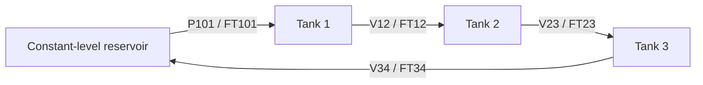

# Three-Tank model

`scenario = "three_tank"` · [User guide](../user-guide.md)

## Physical interface



| Interface | Ordered values / units |
|---|---|
| State and output | `[h1, h2, h3]`, m |
| Action | `[P101, V12, V23, V34]`, normalized `[0, 1]` |
| Observation | `[h1, h2, h3, FT101, FT12, FT23, FT34, h1_sp, h2_sp, h3_sp]` |
| Observation scaling | Physical bounds; all flowmeters `0–10 L/min` |
| Hidden conditions | Binary bypasses BV12/BV23/BV34, recorded in `info["disturbance"]` |
| Timing | Control `1 s` |
| Direct control | 4 physical actions, no lower-level controller or simulator action-rate limit; previous action is not observed |

| Equipment / limit | Value |
|---|---|
| Each process tank | `45 L`, `0.3 × 0.3 × 0.5 m`, cross-section `0.09 m^2` |
| Level landmarks | Nominal `0.225 m`; pump trip `0.425 m`; overflow `0.45 m`; hard maximum `0.5 m` |
| Reservoir | Separate `180 L` source/return tank; inventory and temperature are not dynamic states |
| P101 capacity | `25 L/min` |
| Valve capacity over formal levels | Fully open `19.6–25.1 L/min`; at action `0.85`, `16.6–21.3 L/min` |
| Formal circulation | `3–8 L/min`, within the flowmeter span |
| Model units | Hydraulic `m`, `m^2`, `m^3/s`; pump energy estimate in W |

Bypasses run parallel to V12/V23/V34; outlet meters measure the valve branches
only. Overflow returns to the reservoir. Use [Cascade](cascade.md) for temperature control.

<details>
<summary>Bypass disturbance size</summary>

Default coefficient `4e-5 m^(5/2)/s` adds about `1.74 L/min` at `0.225 m`,
or `1.56–2.01 L/min` over formal levels `0.125–0.4 m`. This is approximately
`20–67%` of the `3–8 L/min` circulation; regulating-valve flow stays positive.
Policies infer bypasses from level/flow imbalance, without observing switch positions.

</details>

## Default task

The ordinary fixed episode uses the resolved tracking seed-0 case, without a benchmark label.

| Setting | Value |
|---|---|
| Initial equilibrium levels | `(0.365792, 0.253281, 0.371840) m` |
| Target from reset | `(0.143198, 0.318803, 0.186675) m` |
| Common equilibrium flow | `3.840675 L/min`, with unsaturated steady actions at both ends |
| Horizon | `600 steps = 600 s` |

## Reward and success

| `regulation` component | Definition |
|---|---|
| Tracking objective | All 3 levels; error scale `0.1 m` each for reward and tracking metrics |
| Movement cost | Mean squared change of 4 normalized commands from previous applied action; one actuator changing `0.1` costs `0.0025` at 1 s |
| Safety termination | `2.0 × remaining physical seconds + 100.0` penalty |
| Control success | Safe completion and each level within `0.002 m` in the final window |

[Tracking metrics and success](../user-guide.md#metrics-and-ranking).
Holding a steady circulation action adds no movement cost.

## Controller defaults

| Setting | PI (`pid`) | MPC |
|---|---|---|
| Target bias | Fixed default action; no target/disturbance feedforward update | Model-based steady target |
| Gains / horizon | `kp_scale=8`, `hydraulic_ki_scale=0.02`, `kd=0` | 20 × 1 s actions |
| Update cadence | Every control step | Replan every control step |
| Move / steady weights | — | `5` / `0.5` per actuator |
| Inputs | Same 10 observations as learned policies | Same 10 observations; no hidden bypass positions or schedule preview |

Pump/valve capacity factors exist in the model but are not scheduled by the bypass benchmark.

## Training variation

| Option                   | Sampling                                                                                                                                                |
| ------------------------ | ------------------------------------------------------------------------------------------------------------------------------------------------------- |
| `randomize=True`         | Interior equilibrium → sampled target; 600 steps                                                                                                        |
| Interior envelope        | Levels `0.125–0.4 m`, flow `3–8 L/min`; each level moves ≥ `0.05 m`, no extra move cap                                                                  |
| `boundary_probability=p` | Fraction `p` starts with all levels at `80–92%` of hard maxima; independent feasible interior target                                                    |
| `disturbance=True`       | Open bypasses at step `30–90`, close after 360 s; single/pair/triple probabilities `30%/40%/30%`                                                        |
| Noise / delay / fault    | Independent [channel options](../user-guide.md#inspect-and-configure-an-environment); pump/valve capacity factors are not sampled by `disturbance=True` |

For an explicit ordinary-environment schedule:

```python
import aiogym

with aiogym.make_env(
    "three_tank",
    disturbance_schedule={
        60: {"bv23_open": 1.0},
        420: {"bv23_open": 0.0},
    },
) as env:
    print(env.describe())
```

Values persist until changed; step `0` overrides the initial value. Custom schedules
may accompany `randomize=True`, but not `disturbance=True` or a benchmark.

## Training settings

Use the [training recipe](../user-guide.md#3-train-and-compare) with
`scenario = "three_tank"` and these scenario settings, run from the repository root:

```python
import json
from pathlib import Path

training_steps = 240_000
algorithm_settings = json.loads(
    Path("aiogym/rl/configs/three-tank-sac-nstep10.json").read_text()
)
record_interval = 1_000
validation_interval = 10_000
```

This configuration uses SAC with `n_steps=10` and `gamma=0.9995`. The randomized
training protocol uses 600-second tracking episodes with exact observations.
A 240,000-step budget equals 400 complete episodes if none ends early. The
single-seed configuration is a baseline, not a statistical RL comparison.

For another 60,000 steps, use the shared [continuation recipe](../user-guide.md#continue-training)
with `steps=60_000` and the same recording/validation intervals. To use PPO or
DDPG defaults, change `algorithm` in the workflow setup, use an empty `algorithm_settings`, and choose
separate run paths. Every policy uses the direct four-action interface.

## Benchmarks

| Benchmark | Protocol | Duration |
|---|---|---|
| `tracking` | Feasible equilibrium start → independently sampled three-level target | 600 s |
| `disturbance-rejection` | Same seed's tracking case plus temporary bypass opening | 600 s |
| `boundary-safety` | Legal pump/valve pre-run until one tank reaches `82–84.8%` of maximum | 600 s |

Ranking: **unsafe rate → mean cumulative return**. Seeds `0–19`; fixed `regulation`
reward/default parameters. [Shared evaluation rules](../user-guide.md#metrics-and-ranking).

<details>
<summary>Case sampling and disturbance coverage</summary>

| Setting | Range / rule |
|---|---|
| Tracking levels / flow | `0.125–0.4 m` / `3–8 L/min`; common flow at start and target |
| Target change / steady actions | Each level moves ≥ `0.05 m`; actions `0.02–0.85` |
| Disturbance pairing | Same initial state/action, target, and flow as tracking seed; target active from reset |
| Bypass event | Start `30–90`, duration 360 s; `150–210 s` of post-close tracking |
| Mode probabilities | Single `30%`, simultaneous pair `40%`, all three `30%` |
| Seeds `0–19` coverage | 6 single, 9 pair, 5 triple; includes every branch and every unordered pair |
| Capacity factors | Unchanged |
| Disturbance diagnostics | Full-episode tracking metrics; use saved schedules/trajectories for phase analysis. This benchmark omits `disturbance_iae`, `disturbance_ise`, and `recovery_time` |
| Boundary construction | One of 3 legal pre-run patterns, last safe reachable state; not a boundary equilibrium |
| Saved diagnostics | Resolved case, initial steady action, seed, schedule, trajectories |

</details>

## Parameters and model scope

Query `aiogym.list_parameters("three_tank")`; use `parameters={...}` in ordinary
environments. Geometry, pump/valve capacities, and instrument spans above define
the simulated laboratory process.

## Run this scenario

[Train](../user-guide.md#3-train-and-compare) · [Compare a checkpoint](../user-guide.md#evaluate-a-saved-model)
